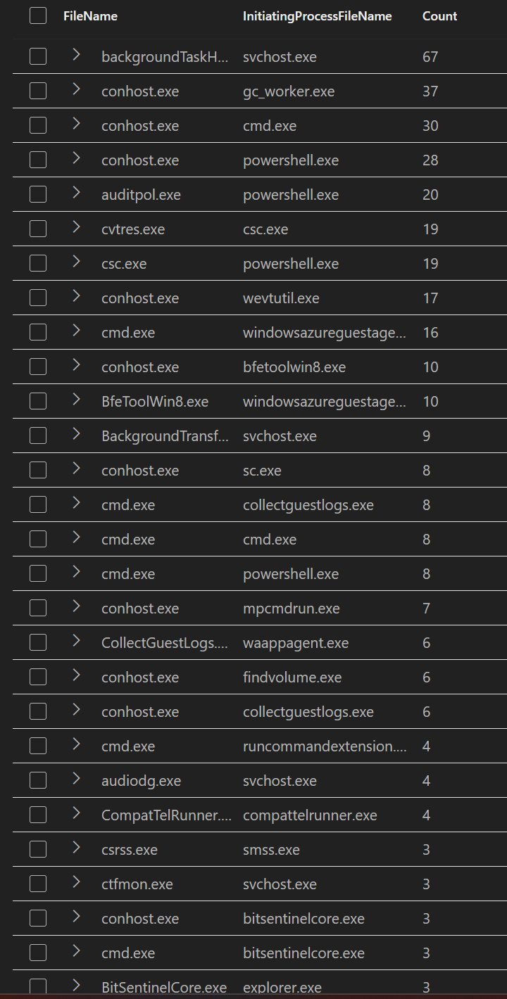
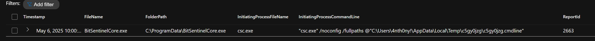
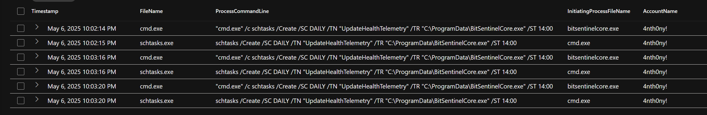
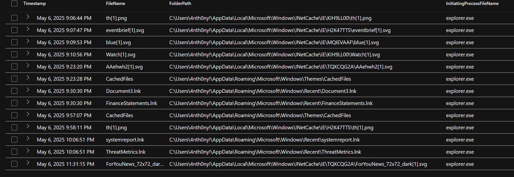
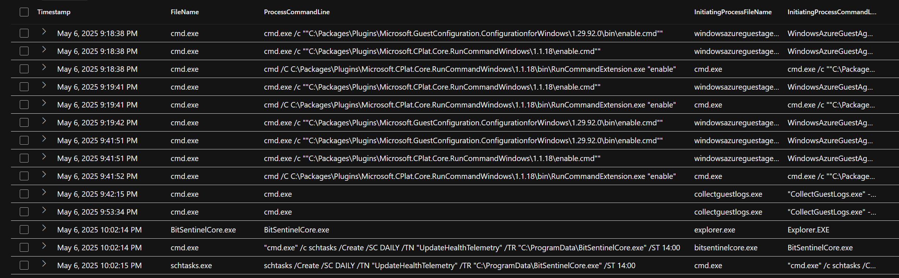
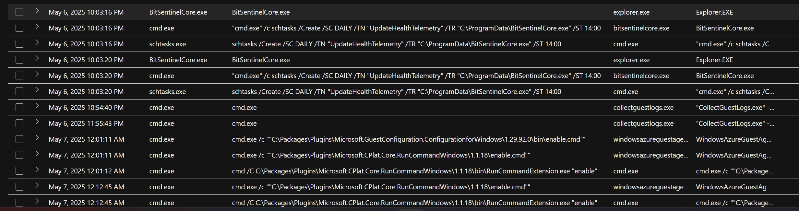
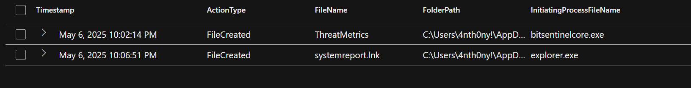

# Threat Hunting Case Study: BitSentinelCore Fake Antivirus Attack

## Overview

This investigation documents a simulated threat scenario in which a fake antivirus executable, `BitSentinelCore.exe`, was compiled and launched on host `anthony-001`, triggering a chain of malicious behaviors. The hunt was conducted using Microsoft Defender for Endpoint and KQL to identify local compilation, persistent footholds via the registry and scheduled tasks, and the behavioral activation of a stealthy keylogger using `.lnk` files.

---

## Objective

* Identify the initial suspicious executable
* Determine how it was dropped and executed
* Uncover persistence mechanisms (registry, scheduled task)
* Discover behavioral triggers related to keylogger activation
* Correlate all findings into a single, rooted timeline

---

## Investigation Timeline & KQL Queries

### Initial Binary Discovery

```kql
DeviceProcessEvents
| where DeviceName == "anthony-001"
| where FileName startswith "A" or FileName startswith "B" or FileName startswith "C"
| summarize Count = count() by FileName, InitiatingProcessFileName
| order by Count desc
```

➡️ Identified `BitSentinelCore.exe` as a suspicious binary not tied to system or known software.



---

### BitSentinelCore Dropped via Local Compilation

```kql
DeviceFileEvents
| where DeviceName == "anthony-001"
| where FileName == "BitSentinelCore.exe"
| project Timestamp, FileName, FolderPath, InitiatingProcessFileName, InitiatingProcessCommandLine, ReportId
| order by Timestamp asc
```

➡️ BitSentinelCore was compiled using `csc.exe`, sourced from a `.cmdline` config in the user’s temp directory.



---

### Manual Execution of BitSentinelCore.exe

```kql
DeviceProcessEvents
| where DeviceName == "anthony-001"
| where ProcessCommandLine has "BitSentinelCore.exe"
| project Timestamp, FileName, FolderPath, ProcessCommandLine
| sort by Timestamp asc
```

➡️ The file was manually executed via Explorer. Each execution triggered additional malicious behavior.


---

### Scheduled Task Creation via schtasks

```kql
DeviceProcessEvents
| where DeviceName == "anthony-001"
| where ProcessCommandLine has "schtasks"
| project Timestamp, FileName, ProcessCommandLine, InitiatingProcessFileName, AccountName
| order by Timestamp asc
```

➡️ A scheduled task named `UpdateHealthTelemetry` was created to ensure malware persistence.



---

### Registry-Based Persistence

```kql
DeviceRegistryEvents
| where DeviceName == "anthony-001"
| where RegistryKey has_any ("Run", "Input", "Keyboard", "Hook")
| project Timestamp, RegistryKey, RegistryValueName, RegistryValueData, InitiatingProcessFileName
```

➡️ Malware added itself to the `HKCU\Software\Microsoft\Windows\CurrentVersion\Run` key under `BitSecSvc`.


---

### LNK File Trigger Discovery

```kql
DeviceFileEvents
| where DeviceName == "anthony-001"
| where InitiatingProcessFileName == "explorer.exe"
| project Timestamp, FileName, FolderPath, InitiatingProcessFileName
| order by Timestamp asc
```

➡️ Discovered `systemreport.lnk`, suggesting user interaction triggered malware behavior.



---

### Full Process Chain Reconstruction

```kql
DeviceProcessEvents
| where DeviceName == "anthony-001"
| where FileName in ("BitSentinelCore.exe", "cmd.exe", "schtasks.exe")
| project Timestamp, FileName, ProcessCommandLine, InitiatingProcessFileName
| order by Timestamp asc
```

➡️ Confirmed malware chain: `BitSentinelCore.exe` → `cmd.exe` → `schtasks.exe`



---

### Persistent Activity Over Time

➡️ Multiple re-executions of the malware and command-line tools validated scheduled and registry persistence.



---

### ThreatMetrics vs. systemreport.lnk Timeline Analysis

➡️ `ThreatMetrics` was dropped immediately on execution — likely a decoy. `systemreport.lnk` appeared shortly after via Explorer, marking it as the behavioral keylogger trigger.



---

## Artifacts & Evidence

* BitSentinelCore.exe (compiled via csc.exe)
* Registry key: `HKCU\...\Run\BitSecSvc`
* Scheduled task: `UpdateHealthTelemetry`
* `.lnk` file: `systemreport.lnk`
* Decoy file: `ThreatMetrics`

---

## Lessons Learned

* Fake antivirus malware can use local compilation to avoid download detection
* Combining registry, task scheduler, and shortcut triggers ensures stealthy persistence
* Behavioral triggers (e.g., `.lnk` launch via Explorer) can indicate user deception and lateral persistence methods

---

## Tools & Skills Demonstrated

* Microsoft Defender for Endpoint
* KQL (Kusto Query Language)
* Persistence detection techniques
* File and process analysis
* Incident timeline construction

---

## Outcome

The full malware chain was exposed and attributed to the execution of `BitSentinelCore.exe` at `2025-05-07T02:00:36.794406Z`. The attacker maintained access through multiple stealthy persistence layers and used deceptive shortcuts to trigger a likely keylogger.

---

**Status:** ✅ Complete
**Scenario:** "The Phantom Hackers – BitSentinelCore.exe"
**Author:** Eric Russo
