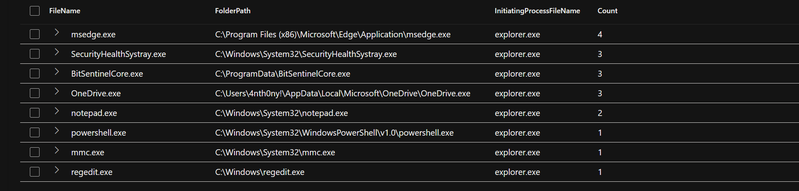

# Threat Hunt Report: Fake AV with Registry + Task Scheduler Persistence

**A threat hunting investigation into a fake antivirus executable used to establish persistent access via registry keys, scheduled tasks, and shortcut-based keylogger triggers.**

---

## Initial Binary Discovery

We began by analyzing process activity on host `anthony-001` using the following query:

```kql
DeviceProcessEvents
| where DeviceName == "anthony-001"
| where FileName startswith "A" or FileName startswith "B" or FileName startswith "C"
| summarize Count = count() by FileName, InitiatingProcessFileName
| order by Count desc
```

This led us to identify **BitSentinelCore.exe** as suspicious:

* Mimicked legitimate AV naming (like SentinelOne)
* Spawned scripting-related child processes (`cmd.exe`, `conhost.exe`)
* Initiated by `explorer.exe`, implying user interaction



---

## BitSentinelCore Dropped via Local Compilation

We used file creation telemetry to trace how BitSentinelCore was introduced:

```kql
DeviceFileEvents
| where DeviceName == "anthony-001"
| where FileName == "BitSentinelCore.exe"
| project Timestamp, FileName, FolderPath, InitiatingProcessFileName, InitiatingProcessCommandLine, ReportId
| order by Timestamp asc
```

Result: It was compiled locally with `csc.exe` from a `.cmdline` file in the user's Temp directory.


---

## Manual Execution of BitSentinelCore.exe

We confirmed user interaction by tracking process execution commands:

```kql
DeviceProcessEvents
| where DeviceName == "anthony-001"
| where ProcessCommandLine has "BitSentinelCore.exe"
| project Timestamp, FileName, FolderPath, ProcessCommandLine
| sort by Timestamp asc
```

* Three direct launches via `explorer.exe`
* Indicates user manually ran the file


---

## Scheduled Task Persistence

```kql
DeviceProcessEvents
| where DeviceName == "anthony-001"
| where ProcessCommandLine has "schtasks"
| project Timestamp, FileName, ProcessCommandLine, InitiatingProcessFileName, AccountName
| order by Timestamp asc
```

Confirmed persistence via scheduled task:

* Name: `UpdateHealthTelemetry`
* Path: `C:\ProgramData\BitSentinelCore.exe`
* Triggered daily at 2:00 PM


---

## Persistence via Registry Key

We investigated registry modifications:

```kql
DeviceRegistryEvents
| where DeviceName == "anthony-001"
| where RegistryKey has_any ("Run", "Input", "Keyboard", "Hook")
| project Timestamp, RegistryKey, RegistryValueName, RegistryValueData, InitiatingProcessFileName
```

We found BitSentinelCore adding itself to:

```
HKCU\Software\Microsoft\Windows\CurrentVersion\Run\BitSecSvc
```


---

## Behavioral Trigger: systemreport.lnk

Looking at Explorer-created files:

```kql
DeviceFileEvents
| where DeviceName == "anthony-001"
| where InitiatingProcessFileName == "explorer.exe"
| project Timestamp, FileName, FolderPath, InitiatingProcessFileName
| order by Timestamp asc
```

We discovered `systemreport.lnk` and other `.lnk` files:

* Created by `explorer.exe`
* Suggest user clicked shortcut that launched BitSentinelCore again


---

## Full Process Chain

```kql
DeviceProcessEvents
| where DeviceName == "anthony-001"
| where FileName in ("BitSentinelCore.exe", "cmd.exe", "schtasks.exe")
| project Timestamp, FileName, ProcessCommandLine, InitiatingProcessFileName
| order by Timestamp asc
```

Observed chain:

```
explorer.exe → BitSentinelCore.exe → cmd.exe → schtasks.exe
```


---

## Persistent Activity Over Time

Later logs show recurring `cmd.exe` and other executions:

* Confirms persistence mechanisms worked
* Continued activity well after initial infection


---

## Final Correlation — Keylogger Trigger

By comparing timestamps:

* `BitSentinelCore.exe` executed: `2025-05-07T02:00:36.794406Z`
* Dropped: `ThreatMetrics`
* Triggered: `systemreport.lnk` via explorer


This timeline supports that `systemreport.lnk` was the behavioral trigger for the keylogger or surveillance payload.

---

**Status:** ✅ Complete
**Tooling:** Microsoft Defender for Endpoint (MDE), KQL


